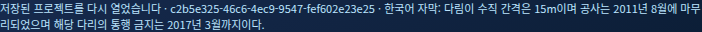

# MINDLE MEDIA AI 제품 E2E 검수 — 2026-10-08

결과: **BLOCKED_EXTERNAL_SHORTFORM_INTEGRATION**. VIDEO → 한국어 STT → Save/Close/Reopen → 기본 제품 Export는 실제 브라우저 실행 PASS입니다. 전체 제품 최종 PASS는 선언하지 않습니다.

- Epoch: MEDIA-AI-20261008-PRODUCT-E2E-VIDEO-PREVIEW-TO-FULL-PASS-R1
- 실행 소스 HEAD: `99a9cd4fcdced32a728db06f0692a394c9a4dfd2`
- Canonical branch: `feature/ad-shortform-bridge-p0-20260926`
- [실제 실행 37738880868](https://github.com/ADAMBUILD-ai/mindle-media-ai/actions/runs/37738880868)
- [검수 아티팩트 11533405537](https://github.com/ADAMBUILD-ai/mindle-media-ai/actions/runs/37738880868/artifacts/11533405537)
- 아티팩트 ZIP SHA-256: `d76770a6724348adaa18a0c5d4a2fa4bc7dd4abbd0df4801c206c40baefb7e03`. 다운로드 후 해시와 전체 ZIP CRC를 독립 확인했습니다.
- Actions 결론은 failure이며, 실행 스크립트가 외부 의존성 차단을 알리는 exit 3으로 끝났습니다. 이는 전체 성공으로 재표기하지 않습니다.

## 원인과 수정 범위

원본 tracking Job `e6dd3b92-9b98-4d9f-82e1-dfeb64c51d91`은 TESTED_PASS이며, 정확한 미리보기 URL의 GET은 HTTP 200 / video/mp4이고 원본 해시와 일치했습니다. 해당 VIDEO 요소에서 먼저 실제 진단을 기록했습니다.

| 항목 | 원본 tracking | H.264 파생 미리보기 |
|---|---|---|
| codec | mpeg4 / mp4v | h264 / avc1 |
| MediaError | 4 / DEMUXER_ERROR_NO_SUPPORTED_STREAMS | 없음 |
| readyState | 0 | 4 |
| networkState | 3 | 1 |
| 크기 | 브라우저 0×0; ffprobe 512×292 | 브라우저 512×292 |
| canPlayType | mp4v 빈 문자열 | H.264 probably |
| 실제 재생 | 시작 불가 | currentTime 0.531419, paused=false |
| GET / 해시 | 200 / 원본 일치 | 200 / 파생 파일 일치 |

**분류: 모델 처리 실패나 Job 상태 조회 실패가 아니라, 정상 생성된 mp4v 산출물의 브라우저 디코딩 실패입니다.** preview 요소의 jobId·operation·currentSrc도 원본 tracking과 정확히 일치했습니다. 브라우저 console은 빈 배열이었고, 구체적 오류는 MediaError.message에서 확보했습니다.

`browser_preview.py`와 제품 runtime/server에 기존 FFmpeg 경로를 사용한 CPU libx264 / yuv420p / +faststart 파생 파일을 추가했습니다. 원본 primary_output, tracking JSON, mask, JOB_EVIDENCE와 해시는 유지하며 preview_output만 별도로 선택합니다. 원본 해시가 틀리거나 libx264가 없으면 실패하고, 다른 코덱으로 자동 대체하지 않습니다. 정확한 명령·버전·probe·입출력 해시는 H264_PREVIEW_PROBE.json에 있습니다.

UI 동작 수정은 기존 미리보기의 오류 표시, 파생 결과 선택, 중복 Job 제거, STT 완료 텍스트 유지와 재열기 시 자막 트랙 복원입니다. 개발 실행 환경에서도 저장 프로젝트를 복원하도록 서버의 기존 제한을 해제했습니다. HTML·확정 CSS·배치·색상은 변경하지 않았습니다. CI에는 한국어 화면 캡처를 위한 시스템 폰트를 설치했습니다. 기존 300초 Timeout을 늘리지 않았습니다.

## 실제 검증 결과

| Gate | 판정 | 증거 |
|---|---|---|
| PHOTO 분할·4× / tracking 모델 | FROZEN PASS 유지 | 원본 아티팩트 11531386885 재사용; 입력·출력 SHA 확인; 모델 재실행 없음 |
| VIDEO 진단 | PASS | VIDEO_BROWSER_DIAGNOSTICS.json; 수리 전에 실제 오류 기록 |
| H.264 Preview / 실제 브라우저 재생 | PASS | VIDEO_BROWSER_DECODE_RESULT.json; 원본·파생 동일 Job |
| 한국어 STT / UI 표시 | PASS | TESTED_PASS; 입력 SHA·transcript SHA; VIDEO tracking 보존; KOREAN_STT_UI.png |
| Save / 전체 종료 / Reopen | PASS | 새 서버와 새 Chrome 세션; project ID·저장 파일 SHA·Job ID·모든 산출물 해시 유지; PHOTO·tracking·STT 복원 |
| 기본 제품 Export | PASS | 실제 UI Export 및 브라우저 다운로드; ZIP 2,873,475 bytes; CRC·16개 항목·모든 media SHA·UI SHA 일치 |
| 실제 Marketing HTTP 계약 | BLOCKED | runner에서 실제 공급자 연결 불가, bridge token 미설정 |
| 승인 AVORA / 9:16 Preview / 대표 승인 / 광고 MP4 Export | NOT_REACHED | SHORTFORM_INTEGRATION_RESULT.json |
| 최종 전체 제품 PASS | FORBIDDEN | 미완료 외부 Gate가 존재 |

원본 tracking SHA: `41a9c54966fe89a636873839402fdc3d2530fbb80e8eb2c3559f0fc815acbe69`.

파생 Preview SHA: `451e9c9dd51a9e3f01412873b8293a9a0d60af542f7a971dd09529fc8de5ad4e`.

Export SHA: `0453fd2bfb2950a91510a0f47ab8ca9ad4c9ba84a9a1da42515b4205f42c43a5`.

프로젝트: `c2b5e325-46c6-4ec9-9547-fef602e23e25`. 저장 직후 SHA와 전체 종료 후 SHA는 `cb0a7922adef97591f8151c860f830dfe6a9b889d91856d1f473216bfec5d123`로 일치했습니다. Export가 수행하는 후속 Save는 saved_at을 갱신하므로 Export ZIP의 project.json은 후속 저장본입니다.

원본 JOB_EVIDENCE 5개는 이전 아티팩트와 바이트 단위로 동일했습니다. 별도로 다운로드된 Export ZIP을 열어 CRC와 모든 산출물 해시도 다시 검증했습니다. INDEPENDENT_ARTIFACT_AUDIT.json을 참조하십시오.

STT는 한국어 실제 추론과 UI 표시를 검증했습니다. 기준 transcript를 입력하지 않았으므로 WER 정확도 검증은 수행하지 않았습니다. 광고용 승인 MP4 Export와 기본 제품 ZIP Export는 별도 Gate입니다.

## 테스트·Control Plane·시행 이력

최종 제품 runner에서 Python **66 PASS**, UI **2 PASS**, pip check **No broken requirements found**, Control Plane validator **PASS**입니다. Canonical baseline 실행 37738880875도 SUCCESS이며 64 PASS / FFmpeg 미설치로 신규 변환 테스트 2 SKIP / UI 2 PASS입니다. 변환 테스트 2개는 FFmpeg가 있는 제품 runner에서 실제 실행해 PASS했습니다. 기존 import 오인 방지·실패 즉시 종료·PHOTO·tracking 회귀를 포함합니다.

앞선 실행 37738139042·37738221986은 이전 package metadata의 OpenCV >=5.0과 pinned 4.12 충돌로 브라우저 단계 전에 실패했습니다. 현재 요구사항을 >=4.12,<6으로 맞추고 현재 소스를 재설치한 다음 pip check를 통과했습니다. 37738309658은 기본 제품 Gate를 통과했으며, 최종 실행에서 STT 복원 표시와 읽을 수 있는 한국어 화면 증거까지 다시 확인했습니다.

기존 두 runtime 패키지 워크플로가 새 `package_build_allowed=false`를 읽지 않아 앞선 PR 갱신에서 자동 패키징됐습니다. 37738139036·37738221991·37738309750의 기존 runtime 모델 번들 아티팩트가 생성됐다는 사실을 LEGACY_AUTO_PACKAGE_GUARD_REVIEW.json에 남겼습니다. 직원용 R2 배포 패키지는 생성하지 않았고, 해당 자동 runtime 아티팩트를 직원 배포 산출물로 채택하지 않습니다.

`d53416b...`에서 두 워크플로에 실제 Control Plane gate를 추가했습니다. 최종 HEAD의 실행 37738880886·37738880882에서는 gate가 false를 출력했고 두 package Job은 **SKIPPED**입니다. 앞선 자동 실행을 소급해 금지 준수 PASS로 처리하지 않습니다.

Control Plane 4종·validator·활성 지시서·Evidence Contract와 확정 HTML/CSS는 제공 HEAD 대비 변경하지 않았습니다. 원격 blob SHA 대조는 REMOTE_READBACK.txt에 있습니다. 역사 Evidence를 삭제하지 않았습니다. PR #23은 draft/open, 미병합이며 **HOLD / DO NOT MERGE**입니다. main SHA는 `797da297f588780ad2d608deea3b5af8f05af450`로 유지했습니다.

## 외부 Gate 재개에 필요한 입력

이 Actions 실행 환경에서 `MARKETING_SHORTFORM_BRIDGE_TOKEN`이 비어 있고 `http://127.0.0.1:4318` 실제 공급자에 연결할 수 없었습니다. 재개에는 runner에서 접근할 수 있는 실제 Marketing URL(`MARKETING_SHORTFORM_BASE_URL` repository variable)과 bridge token(동명의 Actions secret)이 필요합니다. localhost 공급자를 쓴다면 이 runner에서 실제 공급자를 구동하는 승인 실행 경로가 필요합니다.

연결이 확보되면 실제 HTTP 계약 → 승인 AVORA 자산/원본·승인·해시 → 9:16 실제 재생 Preview → 대표 승인 → 실제 MP4 Export 순서로 계속 검증해야 합니다. 현재 자산과 승인 상태는 NOT_REACHED이며, mock·과거 응답·임의 승인으로 대체하지 않았습니다. 자동 게시·광고비 집행은 없습니다.

모든 Gate가 실제 실행 증거로 통과하기 전 `PASS_MINDLE_MEDIA_AI_FULL_PRODUCT_E2E_RUNTIME_VERIFIED`를 결과로 선언하거나 직원 패키지 재생성·main 병합을 진행할 수 없습니다.
